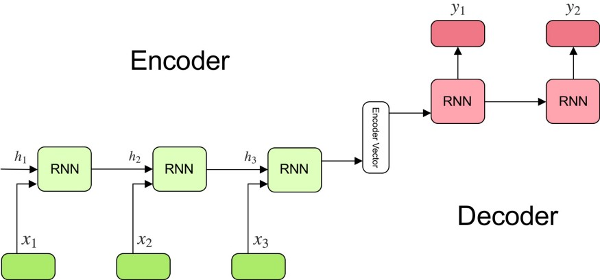

# Neural Machine Translation

This project is about performing Machine Translation using a Neural Network.
We will be translating a source sentence in English to a target sentence in French.

**Dataset used**: Find the dataset in the `data` folder in this repo.

## What is Neural Machine Translation?
Machine translation (MT) is the task of automatically converting source text in one language to text in another language. Neural machine translation, or NMT for short, is the use of neural network models to learn a statistical model for machine translation.

A type of model called Seq2Seq model is used for this purpose.

Below is a simple example where we convert a sentence in English to a sentence in Hindi using a __Seq2Seq__ model:

`"Ram is playing cricket."` -> `[Seq2Seq model]` -> `"राम क्रिकेट खेल रहा है।"`

## Architecture
We have implemented the below architecure in this project.


## Training Plots

If you want to see the training plots, the tensorboard logs has been included in the repo.

Follow the below steps to run tensorboard:
```
%load_ext tensorboard
%tensorboard --logdir '/logs'
```
Or view them directly from the __loss_plots__ folder.

## Results

Input: `I like "peaches", "grapes" and "lemons"`

Output: `jaime les pêches les raisins et les citrons <eos>`

As we can see, the result is fairly accurate.

## Conclusion
We ran the Seq2Seq model on a fairly simply dataset in this project, and hence was able to get a very good score. The model is reusable for larger datasets too, but it will take more time depending on the compute capacity of the machine.