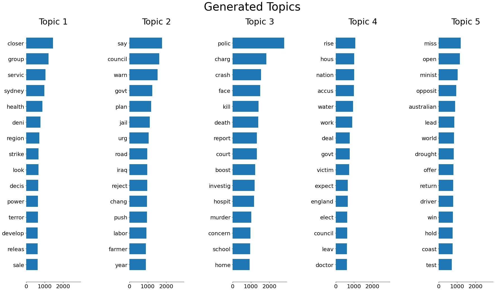

# Topic Modelling using LDA

This project is a hands-on practise on Topic Modelling using LDA.

**Dataset used**: The "Million News Headlines" dataset from ABC (Australian Broadcasting Corporation).

## What is Topic Modelling?
Topic modeling is a method that can automatically analyze and split a large collection of documents into topics. As opposed to rule-based text mining approaches that use regular expressions or dictionary based keyword searching techniques, Topic modeling is an ‘unsupervised’ machine learning technique. It can find pattern hiddens in the data with requiring to label the documents.

**Blog**: Go through this [blog]() to find more details on how LDA actually works.

## Experiments
We peformed the experiment on two sets of data:

  - data created using BoW 
  - data created using TF-IDF

## Results
- on BoW data:

- on TF-IDF data:

## Conclusion
As we can see, when using TF-IDF, heavier weights are given to words that are not as frequent which results in nouns being factored in. That makes it harder to figure out the categories as nouns can be hard to categorize. This goes to show that the models we apply depend on the type of corpus of text we are dealing with.

It is preferable to use BoW for Topic Modelling using LDA.